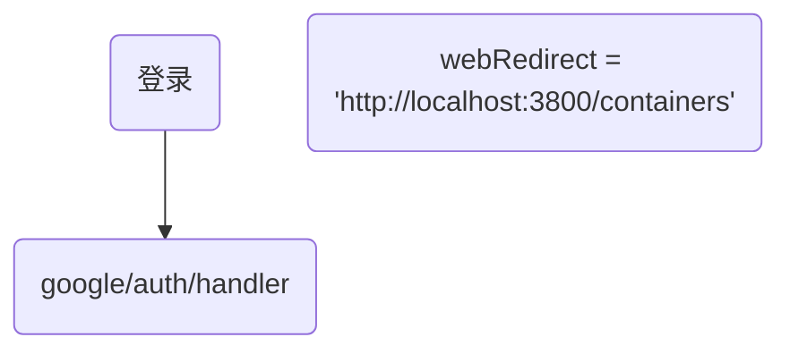

## 1. 


## 2. getServerSideProps 在服务端执行,不在浏览器
并且在每次刷新页面都会执行

getServerSideProps与getStaticProps不同之处。getStaticProps是在构建时执行的，因此在每个请求期间都不会重新执行。这意味着在使用getStaticProps时，每个请求都将使用相同的预先获取的数据。

## 3. 配置
```js
export const jwtConstants = {
  // expiresIn: '3600s'
  // expiresIn: '60s'
  // expiresIn: '200s'
  expiresIn: '300s'
};
```

## 4.配置
https://console.cloud.google.com/apis/credentials/oauthclient/418533224612-o33kb1bi3ilhv3fh0qfbfrbbscliid0s.apps.googleusercontent.com?project=code-platform-389300&supportedpurview=project
```js
const googleRedirectUri = `${HOST}/api/auth/callback/google`

|
V
http://localhost:3888/api/auth/google
```


## 5. 查询
```js
useEffect(() => {
  // useEffect 钩子只会在客户端中执行，因此我们可以在其中使用 window 对象来获取 URL 参数的值
  // 从查询参数中获取访问令牌
  const searchParams = new URLSearchParams(window.location.search);

  // const token = searchParams.get("token") || "";
}
```

## fetch 
```js
const apiConfig = {
  apiEndpoint1: 'https://example.com/api/endpoint1',
  apiEndpoint2: 'https://example.com/api/endpoint2',
  // Add more API endpoints here...
};

const fetchWithAuth = async (url, options = {}) => {
  const token = 'your-bearer-token';

  const response = await fetch(url, {
    ...options,
    headers: {
      ...options.headers,
      Authorization: `Bearer ${token}`,
    },
  });

  return response.json();
};

const api = {
  endpoint1: async (options = {}) => {
    const url = apiConfig.apiEndpoint1;
    return fetchWithAuth(url, options);
  },
  endpoint2: async (options = {}) => {
    const url = apiConfig.apiEndpoint2;
    return fetchWithAuth(url, options);
  },
  // Add more API endpoint functions here...
};

export default api;


const apiConfig = {
  apiEndpoint1: 'https://example.com/api/endpoint1',
  apiEndpoint2: 'https://example.com/api/endpoint2',
  // Add more API endpoints here...
};

const fetchWithAuth = async (url, options = {}) => {
  const token = 'your-bearer-token';

  const response = await fetch(url, {
    ...options,
    headers: {
      ...options.headers,
      Authorization: `Bearer ${token}`,
    },
  });

  return response.json();
};

const api = {
  endpoint1: async (options = {}) => {
    const url = apiConfig.apiEndpoint1;
    return fetchWithAuth(url, options);
  },
  endpoint2: async (options = {}) => {
    const url = apiConfig.apiEndpoint2;
    return fetchWithAuth(url, options);
  },
  // Add more API endpoint functions here...
};

export default api;
```

## .env
```
NEXT_PUBLIC_GOOGLE_CLIENT_ID=418533224612-o33kb1bi3ilhv3fh0qfbfrbbscliid0s.apps.googleusercontent.com

NEXT_PUBLIC_DEV_HOST=http://localhost:3888

NEXT_PUBLIC_PROD_HOST=http://localhost:3888

NEXT_PUBLIC_PROD_HOST=xx
```


```js
@Injectable()
export class AuthGuard implements CanActivate {
  constructor(private jwtService: JwtService, private reflector: Reflector) {}

  async canActivate(context: ExecutionContext): Promise<boolean> {
    const isPublic = this.reflector.getAllAndOverride<boolean>(IS_PUBLIC_KEY, [
      context.getHandler(),
      context.getClass(),
    ]);
    if (isPublic) {
      return true;
    }

    const request = context.switchToHttp().getRequest();
    const token = this.extractTokenFromHeader(request);
    if (!token) {
      console.log('auth.guard UnauthorizedException')
      throw new UnauthorizedException();
    }
    try {
      const payload = await this.jwtService.verifyAsync(token, {
        secret: env('jwt_secret'),
      });

      request['user'] = payload;
    } catch {

      throw new UnauthorizedException();
    }

    return true;
  }

  private extractTokenFromHeader(request: Request): string | undefined {
    const [type, token] = request.headers.authorization?.split(' ') ?? [];
    return type === 'Bearer' ? token : undefined;
  }
}
```