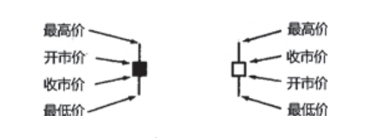

矩形的部分称为实体。它表示了相应交易日的开市价与收市价之间的价格范围。

在实体的上方和下方，各有一条细细的竖直线段，称为影线。
这两条影线分别表示当日市场曾经向上和向下运动的极端价格。

实体上 方的影线称为上影线，实体下方的影线称为下影线。

相应地，上影线的顶端代表了当日的最高价，下影线的底端代表了当日的最低价。



```
以图3.4中的长阳线为例，哪一方占上风？到底是牛还是熊？

显然，牛占上风，因为在当前时间段内市场的开市价差不多就是其最低价，而收市价接近最高价。

图3.5恰好相反，是一根具有长长的黑色实体的蜡烛线，它表示市场的开市价接近当日最高价，收市价接近当日最低价，说明至少在当前时段内，熊占上风。
```

## 第四章-反转形态
```
反转信号的第一种类型：锤子线和上吊线
```


