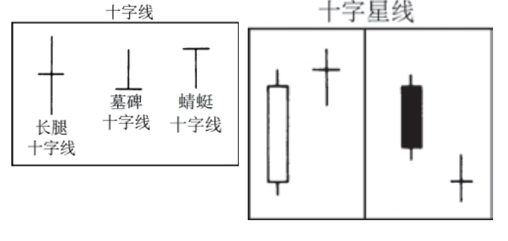

## 十字线，居于最重要的单蜡烛线形态之列。
在某根蜡烛线上，开市价和收市价处于相同的水平（或几乎处于同一个水平），则构成了一根十字线。
 
北方十字线（Northern doji）是出现在上涨行情中的十字线。

南方十字线（Southern doji）是出现在下降行情中的十字线。

## 十字星（蜡烛）线（Doji star）
当一根十字线从前一根长长的白色蜡烛线向上跳空，或者从前一根长长的黑色蜡烛线向下跳空时，就构成了一根十字星线。

十字线具有各种形状（比如墓碑十字线、蜻蜓十字线或者长腿十字线），这取决于开市价和收市价相对于本时段整个价格范围的位置。

蜻蜓十字线（Dragonfly doji）——带有长长的下影线的十字
线，其中开市价和收市价都处在本时段的最高点。参见十字线条目的
示意图。与之对应的版本称为墓碑十字线