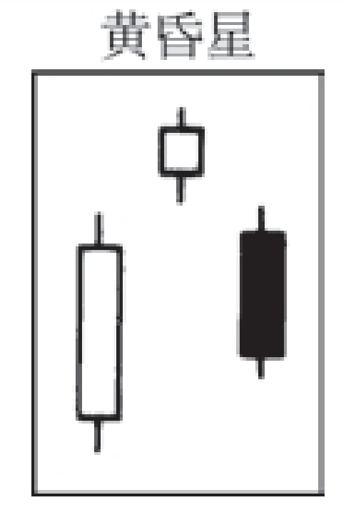

## 十字黄昏星形态

其轮廓与黄昏星形态相同，但是中间的那根蜡烛线（即其中的星线部分）是一根十字星线，而不是一个小实体。参见“黄昏星形态”。


## 黄昏星形态
```
这是一类顶部反转形态，由三根蜡烛线组成。第一根是一个长长的白色实体；第二根是一个小实体（既可以为白色，也可以为黑色），并且它向上跳空，形成了一根星线；

第三根是一个黑色的蜡烛线，其收市价明显地向下穿入第一根白色实体的内部。如果第二根蜡烛线为十字线，而不是纺锤线，则构成了十字黄昏星形态。与之对应的相反形态为启明星形态
```