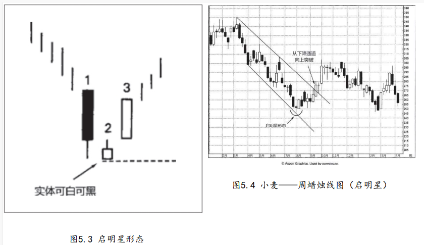

## 启明星形态属于底部反转形态
启明星形态属于底部反转形态（如图5.3所示）。它的名称由来是，就像启明星（金星）预示着太阳的升起一样，这个形态预示着价格的上涨。本形态由三根蜡烛线组成：

```
在理想的启明星形态中，第二根蜡烛线（即星线）的实体，与第三根蜡烛线的实体之间有价格跳空。根据我的经验，即使没有这个价格跳空，

似乎也不会削减启明星形态的技术效力。其决定性因素是，第二根蜡烛线应为纺锤线，同时第三根蜡烛线应显著深入到第一根黑色蜡烛线内部
```

```
启明星形态的不足之处是，既然形态由三根蜡烛线组成，就得等到其中第三个时段收市时，形态才算完成。

在通常情况下，如果第三根蜡烛线是长长的白色线，那么当我们得到信号的时候，市场已经走过一段急速反弹了。换句话说，当启明星形态完成时，或许并不能提供风险报偿比具有吸引力的交易机会。

针对这一点，一种选择是等待行情回落到启明星形态构成的支撑区域时，再小口小口地吃进做多。
```