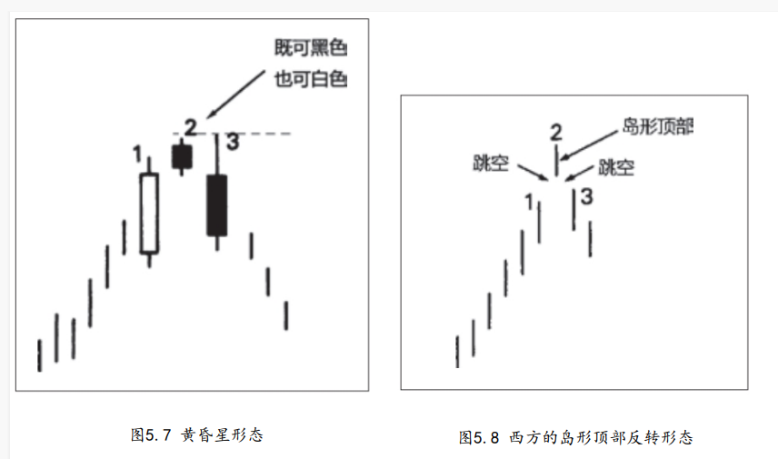

## 黄昏星是启明星的反面对等形态,在顶部，是看跌的。
```
在顶部，是看跌的。

当出现在上升趋势之后，才能发挥其技术效力。

由三根蜡烛线组成的,在前两根蜡烛线中，前一根是长长的白色实体，后一根是星线。


星线的出现，是顶部形态的第一个征兆。第三根蜡烛线证实了顶部过程的发生，完成了属于三线形态的黄昏星形态。

第三根蜡烛线具有黑色实体，它剧烈地向下扎入第一天的白色实体内部。我喜欢把黄昏星比喻为交通指挥信号灯。交通信号灯从绿色（对应于坚挺的白色实体）变成黄色（对应于星线的警告信号），再从黄色变成红色（对应于黑色实体，证实先前的上升趋势已告结束）。 
```



```
原则上说，在黄昏星形态中，首先在第一根实体与第二根实体之间，应当形成价格跳空；然后在第二根实体与第三根实体之间，再形成另一个价格跳空。但是，正如前面关于启明星的部分曾经详细介绍 的那样，上述第二个价格跳空并不常见，而且对本形态的成功来说可有可无，不是必要条件。本形态的关键之处在于第三天的黑色实体向下穿入第一天的白色实体的深浅程度。
```

## 二.十字黄昏星形态
```

```