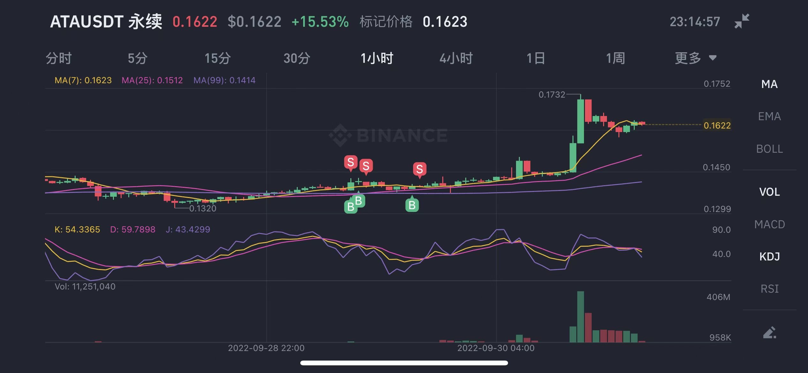
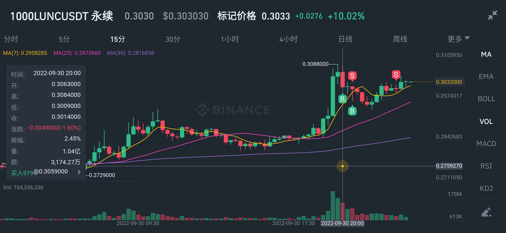
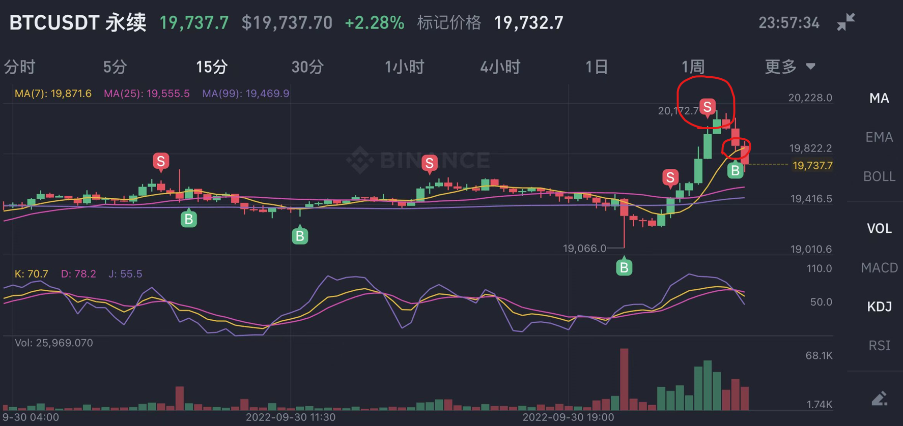

# 交易是反正常人性
1.我要训练的是分辨正常人性和非正常人性的区别，做到交易中不要以正常人性来做交易:
```
交易中错误操作    交易中正确操作/思想
正常人性         非正常人性

贪    婪 <--------> 克制(缓慢积累)
上涨做空 <--------> 上涨做多
下跌做多 <--------> 下跌做空
多空双吃 <--------> 单向做多
```

2.上涨中做空是致命操作
```
2-1.你以为高去做空，正常人性
```

3.下跌中抄底/做多致命操作
```
比如luna,抄底的结果就是所有资金一无所有。
```

4.爆仓经历 高杠杠是致命操作
```
贪婪
情绪化
风险最大化
如果亏钱会继续加大杠杆想回本，最后亏光
```


# 交易纪律

## 零.开仓思考这个点位是否合适
```
如果不经思考的，看到价格大脑一过就开多?开空?
那么我就是在开盲盒,类似在赌硬币落地的正反面。

每次开仓:
1.写下我的开仓逻辑
2.审查这笔订单是否符合我的开仓纪律
3.从大处着眼，小处着手
小时线，日线中判断趋势，从五分钟线中选择合适的点位入手
```

## 一.不要开超过2倍的杠杠
```
一个回撤就会让交易止损，亏损的概率太大
买入机会，卖出风险，杠杠让交易的风险大大增大，杠杠会让你在正常波动的范围止损
```

## 二.不要在高位进场买多

## 三.不要在下跌趋势买多

## 四.不要一有盈利就平仓,要时刻关注趋势
```
想要赚大钱，必须做到
```

## 五.不要亏损扛单
```
想要本金不亏光别扛单
```

## 六.亏钱别情绪化开单，比如加大本金/杠杆 报复性回本操作


# 2022.09.30 交易中的重要思考

### 2022.09.30 ATA 记录
赚大钱：
- 1.必须要拿住,快进快出是很难吃到利润
- 2.必须时刻判断趋势有没走坏
- 3.在趋势走坏止损


### 2022.09.30  LUNC 记录
```
我的逻辑是，大涨后会继续涨，并且上涨趋势,0.305 开单,最后扛不住止损出局：

第一笔交易：
失败的主要原因是入场的时机，这是成败的关键。
我应该在15分钟的十字星阳线入场，或则后面阳线中间入场，我在上涨后的十字星后入场，这是失败的主因。

第二笔交易：
我亏损不甘心，于是下跌中继续开多,想把亏的钱赚回来-->这个是非常致命的。
如果想在交易中存活下去，这种赌性是必须得克服的。

不接受自己的错误，反而希望加大资金，买入更加低的点位来弥补自己以前的亏损/希望爆赚，这个交易行为在未来必然会将自己的资金亏光。
```



### 2022.09.30  short-btc 记录
```
看图中的最后一笔空单，需要反思的地方，还是那个问题，在趋势没走坏，不要平仓。

我还是那种正常人性的操作：
截断盈利，抗死亏损。

想要赚钱:
1.别一有盈利就平仓

想要本金不亏光：
2.别亏损扛单
```


## 2022.26 爆仓交易记录 
在上涨中10倍做空lunc爆仓(60u的10倍)


