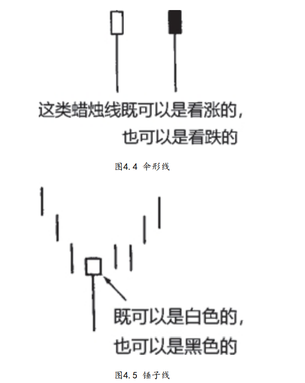
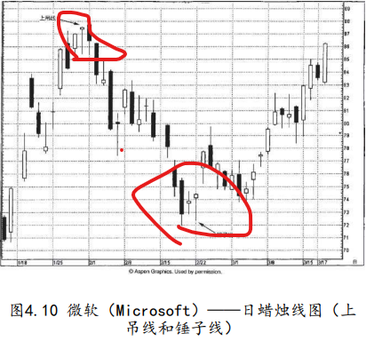

## 一.伞形线



### 1.伞形线-锤子线
```
它们的下影线较长，而实体（或黑或白）较小，并且在其全天价格区间里，实体所处的位置接近顶端。

图4.4所列蜡烛线被称为伞形线，因为它们的轮廓呈伞状，长 长的下影线如伞柄，小实体如伞面。在本图中，我们同时列出了黑白 两种蜡烛线。有趣的是，这两种蜡烛线都既可能是看涨的，也可能是 看跌的，具体情况要由它们在趋势中所处的位置来决定。


伞形线，不管是哪一种，只要它出现在下降趋势中，那么，它就是下降趋势即将结束的信号。在这种情况下，这种蜡烛线称为锤子线
```

### 2.伞形线-上吊线
上吊线的形状与锤子线相同，唯一区别是，上吊线出现在上涨行情之后
```
伞形线的性质取决于伞形线出现之前的主流趋势方向，随趋势而变。在下跌行情之后出现的伞形线是看涨信号，称为锤子线。
在图4.4所示的两种蜡烛线中，无论哪一种，如果出现在上冲行情之后，那么，它就表明之前的市场运动也许已经结束。显而易见，这类蜡烛线就称为上吊线
```

```
1月29日的蜡烛线是上吊线，因为之前趋势是上冲行情。上吊线给
本轮行情创了新高。下一日（2月1日），收市价低于上吊线的实体，
这让所有的新多头——在上吊线当日开市和收市时买进的——通通陷
入困境。

2月22日的蜡烛线是锤子线，因为它出现在下降趋势之后。锤子线
之前的一个交易日也是短实体。这是一条更早出现的线索，表明空头
的努力遭遇了阻碍。而锤子线成为进一步的看涨证据。
```