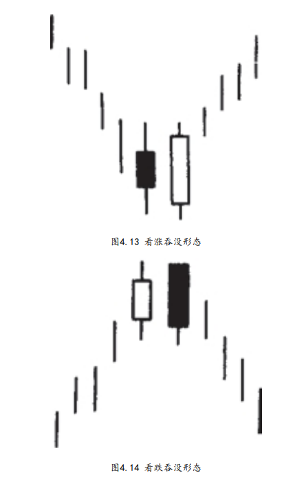
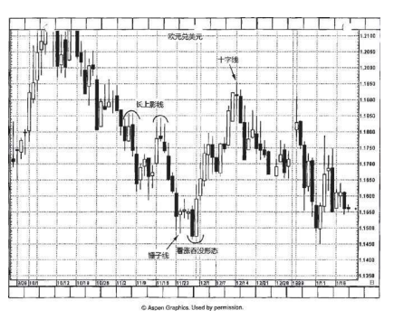

## 二.吞没形态（抱线形态）

```
吞没形态属于主要的反转形态，由两根颜色相反的蜡烛线实体构成。

在西方的技术分析理论中，与日本蜡烛图技术的吞没形态最近似
的是反转日形态。西方反转日形态的具体情形是，在上升趋势（或下
降趋势）的发展过程中，某一日市场创出了新高（或新低），然而当
日的收市价却低于（或高于）前一日的收市价。

关于吞没形态，我们有三条判别标准：
1.在吞没形态之前，市场必须处在明确的上升趋势（看跌吞没形
态）或下降趋势（看涨吞没形态）中，哪怕这个趋势只是短期的。

2.吞没形态由两条蜡烛线组成。其中第二根蜡烛线的实体必须覆
盖第一根蜡烛线的实体（但是不一定需要吞没前者的上下影线）。

3.吞没形态的第二个实体应与第一个实体的颜色相反。（这一条
标准有例外的情况，条件是，吞没形态的第一条蜡烛线是一根十字
线。如此一来，如果在长时间的下降趋势之后，一个小小的十字线被
一个巨大的白色实体所吞没，就可能构成底部反转形态。反之，在上
升趋势中，如果一个十字线被一个巨大的黑色实体所吞没，就可能构
成顶部反转形态）。
```

是看涨吞没形态。在本图中，市场本来处于下降趋
势之中，但是后来出现了一根坚挺的白色实体，这根白色实体将它前
面的那根黑色实体“抱进怀里了”，或者说把它吞没了（该形态正由
此得名）。它有个绰号叫“抱线形态”，道理一目了然。（也许在情
人节那天我会将吞没形态称为“抱线形态”。）这种情形说明市场上
买进压力已经压倒了卖出压力。

看跌吞没形态的示意图。在本图中，市场原本正向着更
高的价位趋升。但是，当前一个白色实体被后一个黑色实体吞没后，
就构成了顶部反转信号。这种情形说明，市场上供给压倒了需求。


#### 2-1
下面列出了一些参考要素，如果吞没形态具有这样的特征，那么
它构成重要反转信号的可能性将大大增强：

- 1.如果在吞没形态中，第一天的实体非常小（即纺锤线），而第
二天的实体非常大。第一天蜡烛线的小实体反映出原有趋势的驱动力
正在消退，而第二天蜡烛线的长实体证明新趋势的潜在力量正在壮
大。

- 2.如果吞没形态出现在超长延伸的或非常快速的市场运动之后。
如果存在非常快速的或超长程的行情运动，则导致市场朝一个方向走
得太远（要么超买，要么超卖），容易遭受获利平仓头寸的打击。

- 3.如果在吞没形态中，第二个实体伴有超额的交易量。我们将在
第二部分讨论交易量分析。


将吞没形态看作阻挡水平和支撑水平，是一个很有用的技巧，尤
其当市场离开低点过远时（看涨吞没形态）或离开高点过远时（看跌
吞没形态），可以借之选择更舒适的卖出或买进点。

### 2-2
原油市场上一个主要低点伴随经典的看涨吞没形态而来。这是一个经典的形态，到此为止第一例。

其中第一根蜡烛线为小黑色实体（这表明空方正在失去立足地），第二根蜡烛线是一根
生机勃勃的长白色实体，开市于最低点、收市于最高点。
本看涨吞没形态之所以特别重要，是因为其中的白色实体不是吞没了之前的一根
黑色实体，而是吞没了三根。

请记住，该形态一方面清晰无疑地揭示了多头已经从空头手中夺得了完全的控制权，另一方面，并没有预示该看涨吞没形态之后接踵而至的上涨运动将达到多大范围。

虽然蜡烛线在发出早期反转信号方面没有任何工具能及，但是它不提供价格目
标。这就是为什么西方技术分析如此重要，因为我们可以运用西方技
术分析工具来预测价格目标。



