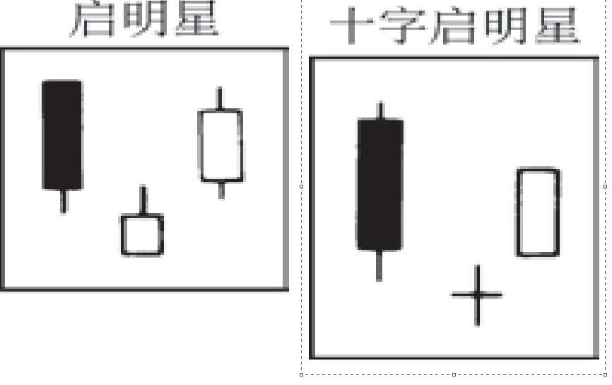

## 十字启明星形态
```
其形状与启明星形态一致，除了其中间的蜡烛线是一个十字线，而不是一个小实体之外。参见“启明星形态”。
```

## 启明星形态
```
这是一种底部反转形态，由三根蜡烛线组成。第一根，是一个长长的黑色实体；第二根，是一个小实体（既可以是白色的，也可以是黑色的），并且它向下跳空，成为一根星线；第三根，是一根白色蜡烛线，其收市价显著地向上穿入
第一根黑色实体的内部。与之对应的相反形态称为黄昏星形态（Evening star）。如果中间的蜡烛线（星线部分）是一根十字线，而不是纺锤线，那么本形态就成为十字启明星形态。
```