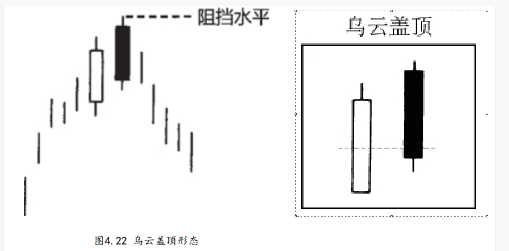

## 三.乌云盖顶形态

```
这种形态也是由两根蜡烛线组成的，属于顶部反转形态。它一般出现在上升趋势之后，有些情况下也可能出现在水平调整区间的顶部。在这一形态中，第一天是一根坚挺的白色实体；

第二天的开市价超过了第一天的最高价（就是说超过了第一天上影线的顶端），但是到了第二天收市的时候，市场却收市在接近当日最低价的水平，并且明显地向下扎入第一天白色实体的内部。

第二天的黑色实体向下穿进第一天的白色实体的程度越深，则该形态构成顶部反转形态的可能性就越大。

有些日本技术分析师要求，第二天黑色实体的收市价必须向下穿过前一天白色实体的50%。如果黑色实体的收市价没有向下穿过白色蜡烛线的中点，那么，当这类乌云盖顶形态发生后，或许我们最好等一等，看看是否还有进一步的看跌验证信号。
```