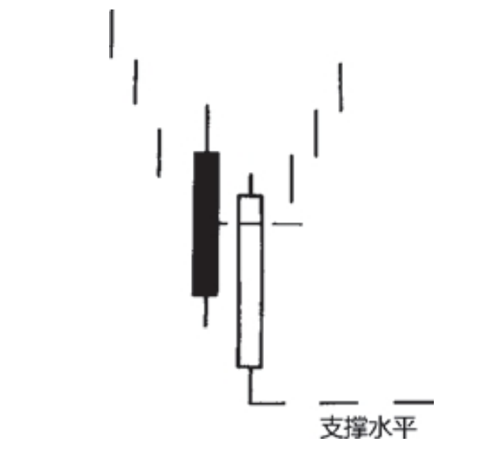
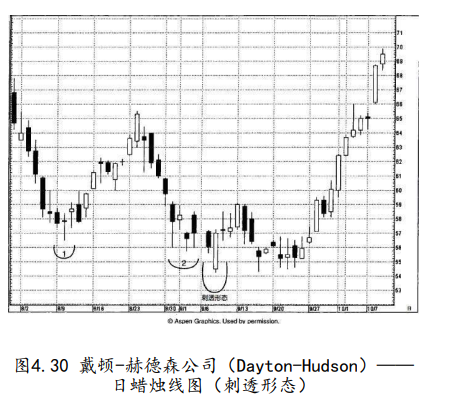
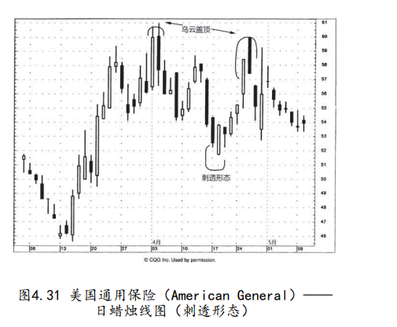

## 四.刺透形态-出现在下跌的市场上
与乌云盖顶形态相反的形态，它的名称为刺透形态

白色实体必须推升到黑色实体的中点以上，才能构成较为有效的底部反转信号。

出现在下跌的市场上，也是由两根蜡烛线所组成的。其中第一根蜡烛线具有黑色实体，而第二根蜡烛线则具有白色实体。在白色蜡烛线这一天，市场的开市价曾跌到低位，最好下跌至前一个黑色蜡烛线的最低价之下，但是后来市场又将价格推升回来，深深刺入黑色蜡烛线的实体内部。


```
而在看涨的刺透形态中，白色实体仅仅向上刺入了前一个黑色实体的内部，但是未能完全覆盖。

在刺透形态中，白色实体向上刺入黑色实体的程度越大，该形态构成底
部反转信号的可能性就越大。在理想的刺透形态中，白色实体必须向
上穿入前一个黑色实体的中点水平以上。关于刺透形态背后的心理过
程，可以做如下理解：市场本来处于下降趋势中，刺透形态第一天疲
弱的黑色实体加强了这种市场预期。第二天，市场以向下跳空的形式
开市。到此刻为止，空头观察着行情的发展，感觉诸事顺遂。可是到
当日收市的时候，市场却涨了回去，结果收市价不仅完全回到了前一
天的水平，而且变本加厉地向上大大超越了这个水平。现在，熊方开
始对手上的空头头寸忐忑不安起来。

有些市场参与者一直在寻找买进的机会，他们据此推断，市场不能维持这个新低价位，或许这正是入市做多的大好时机。

白色实体必须推升到黑色实体的中点以上，才能构成较为有效的底部反转信号。


关于刺透形态，也有四项参考因素，如果刺透形态兼具这些特征，那么它的技术分量将大为增强。这四项参考因素与乌云盖顶形态的四项参考因素内容相同，而方向相反
```


