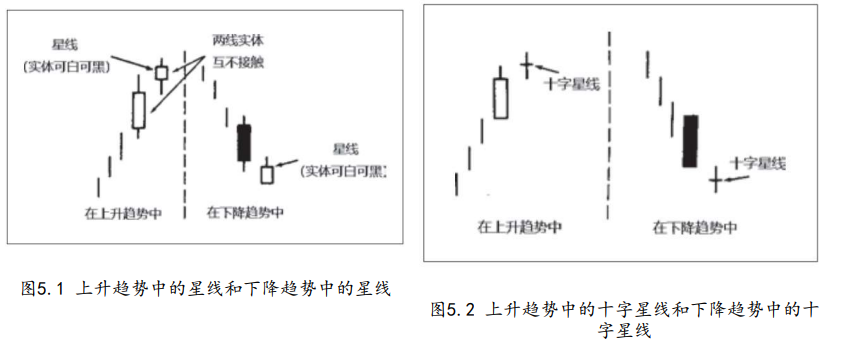

它们的共同点是都包含星蜡烛线。

如图5.1所示，星蜡烛线（简称星线）的实体较小（可以是白色，也可以是黑色），并且在它的实体与它前面较大的蜡烛线实体之间形成了价格跳空。

换句话说，星线的实体可以处在前一个时段的上影线范围内；只要星线的实体与前一个实体没有任何重叠（有一些例外情形，本章后面还要讨论），那么这个星蜡烛线就是成立的。

如果星线的实体已经缩小为十字线，则称之为十字星线（如图5.2所 示）。当星线，尤其是十字星线出现时，就是一个警告信号，表明当前的趋势或许好景不长了。



星线较小的实体显示，空头和多头的拔河已经转入僵持状态。
## 1.在强劲的上升趋势中
```
在强劲的上升趋势中，多头一直掌握主导地位。在这种情况下，如果出现了一根星线，则构成警告信号：市场原本受买方的控制，现在转变为买方与卖方势均力敌的僵持状态。

这一僵局的发生，既可能是由买方力量的衰减所造成的，也可能是由卖方力量的增长所造成的。但不论出于哪一种原因，星线都能告诉我们，当前上升趋势的驱动力已经
瓦解，市场容易遭到卖方的攻击而向下回落。
```

## 2.在下降趋势中出现了星线
```
也是同样的道理，只是方向相反（有时，人们把下降趋势中出现的星线称为“雨滴”）。具体地说，在下降趋势中，一根长长的黑色蜡烛线鲜明地显示出空头占主动地位。之后出现了星线，反映出市场氛围的改变。此时，牛、熊双方的力量对比已经变得较为平衡 了。

如此一来，市场向下的能量也就减退了。这种局面当然是不利于 熊市继续发展的。
```

## 3.种类
```
1.星线-启明星形态。
2.星线-黄昏星形态。
3.星线-十字星形态。
4.星线-流星形态。
```