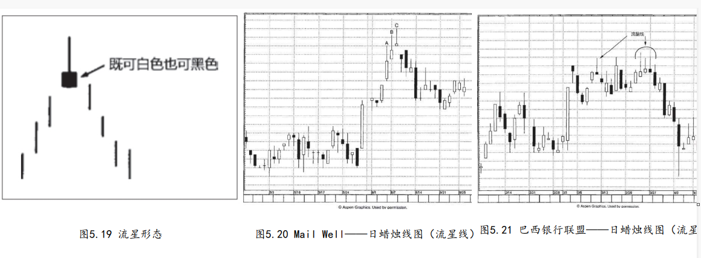

## 1.
在流星形态中，流星线具有较小的实体，而且实体处于其价格区间的下端，同时，流星线的上影线较长。

```
与所有的星蜡烛线一样，流星线实体的颜色并不重要。流星线的形状形象地显示，当日市场开市于它的最低点附近，后来强烈地上冲，但最后却向下回落，收市于开市价附近。换句话说，这个交易时段内的上冲行情不能维持下去。

因为流星线属于看跌反转信号，它必须出现在一段上冲行情之
后。在理想的流星形态中，流星线的实体与前一根蜡烛线的实体之间
存在价格跳空。不过我们将从几个实例中看到，这样的价格跳空并非
总是必须的。在流星形态中，没有向上跳空恰恰给它的负面意义增添
了一个理由。

正如第七章将介绍的，其原因在于向上跳空本身是一个
正面信号。在日本术语里，向上跳空被称为“向上的窗口”。如此一
来，在流星形态中没有向上跳空的情况下，我们可以更安心地判断趋
势即将转入不那么牛气的状态。
```


```
在图5.20中，假如不是采用蜡烛图格式，而是线图格式，那么时
段A、B和C反映出的是健康的市场环境，因为每个时段都具备更高的高
点、更高的低点以及更高的收市价。可是，从蜡烛图技术的角度来观
察，我们从它们三者得到的是警告性的图形信号，头顶上悬着麻烦
呢。具体说来，A、B和C三处看跌的上影线突出地显示该股票正处在
“苦恼的上涨”过程中（日本人就是这么说的）。在时段C，关于顶部
反转的最终验证信号来了，这是一根流星线。或许您注意到，墓碑十
字线（第八章将讨论）的外形与流星线看起来相像。墓碑十字线是流
星线的特殊形式。流星线具备小实体，而墓碑十字线——作为一个十
字线——没有实体。因此，墓碑十字线比流星线来得更疲软。
```


```
在图5.21中，出现了一系列流星形态，其中第一根流星线发生在3
月10日，位于34.50美元。

几周后，三根前后相续的流星线出现在同一个水平上，34.50美元。这就告诉我们，虽然多头每一次都有力气把股票推升到34.50美元，但是这些都是日内新高，多头甚至不能把日内新高维持到收市时。换言之，这些流星线发出视觉信号，揭示市场正在排斥更高的价位。正如本例所示，一旦我们在同一个价格水平得到了一个又一个信号，自然增加了这个阻挡区域的分量。在本例中，几条流星线在同一个水平相互验证，极大地提升了此处形成行情反转的可能性。当然，如果多头有足够的力量以收市价向上突破一众流星线的高点，那么任何看跌观点都需要重新推敲了。
```