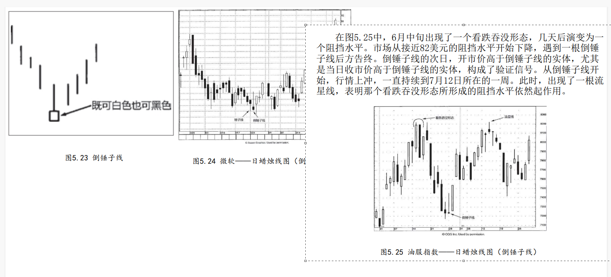

## 1.倒锤子线

虽然倒锤子线不属于星线形态，但是因为它的外形与流星线相像


它也有较长的上影线和较小的实体，并且实体居于整个价格范围的下端。

两者之间唯一不同的是，倒锤子线出现在下降行情之后。

结果，流星线是一根顶部反转蜡烛线，而倒锤子线却是一根底部反转蜡烛线。

倒锤子线实体的颜色无关紧要。同一种形状的蜡烛线既可以是看涨的，也可以是看跌的，取决于在其出现之前 的趋势方向，

在这个概念上，倒锤子线和流星线是一对，锤子线和上吊线是一对（参见第四章）。


```
正如上吊线需要其他看跌信号的验证，倒锤子线也需要其他看涨信号的验证。验证信号既可以是次日开市价高于倒锤子线的实体，也可以是次日收市价高于倒锤子线的实体，尤其是后者更为有力。 
```


倒锤子线需要看涨信号的验证，是因为它的长上影线给倒
锤子线涂上了一层疲软的色彩。也就是说，在倒锤子蜡烛线当日，市
场的开市价位于当日最低价处，或者接近最低价。后来市场上涨了，
但是多头无力将上涨行情维持下去。最后，市场收市于当日最低价，
或者在最低价的附近。为什么这样的蜡烛线竟然是潜在的看涨反转信
号呢？其解答必须从后一天的行情中寻找。如果后一天市场开市于倒
锤子线的实体之上，特别是收市于倒锤子线的实体之上，则意味着凡
是在倒锤子线当日开市和收市时卖出做空的人现在通通处于亏损状
态。市场维持在倒锤子线实体之上的时间愈久，则上述空头止损出市
的可能性愈大。在这种情况下，首先可能引发空头平仓上涨行情，空
头平仓上涨行情进而可能促使企图抄底做多的人跟风买入。这个过程
自我循环，螺旋上升，结果就可能形成一段上冲行情。


在图5.24中，5月24日的一根锤子线在76美元构成了支撑水平。次
日，形成了一个倒锤子线。它为当前市场变动创下了收市价的新低，
如此一来，它就延续了原来向下的短期趋势方向。无论如何，锤子线
的支撑水平依然保持完好。5月26日的收市价起到了一石二鸟的作用：
首先，它再次确认了锤子线的支撑作用；其次，它为倒锤子线提供了
验证信号，因为它的收市价高于倒锤子线的实体。如果对76美元的支
撑水平还要求进一步的看涨验证信号，那么6月2日又来了另一个锤子
线。