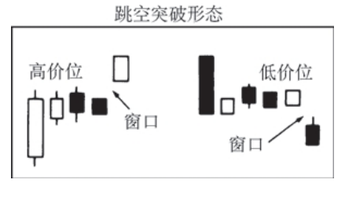

## —共有两类跳空突破形

1.高价位跳空突破形态（High-price gapping play）——市场在
经过一轮急剧的上涨之后，通过一系列位于最近新高水平附近的小实
体进行调整、巩固。如果价格从这个整固区域向上跳空，则构成一个
高价位跳空突破形态。

2.低价位跳空突破形态（Low-price gapping play）——市场在
经历一轮急剧的下跌之后，通过一系列位于最近新低水平附近的小实
体进行调整、巩固。如果价格从这个整固区域向下跳空，则构成一个
卖出信号。