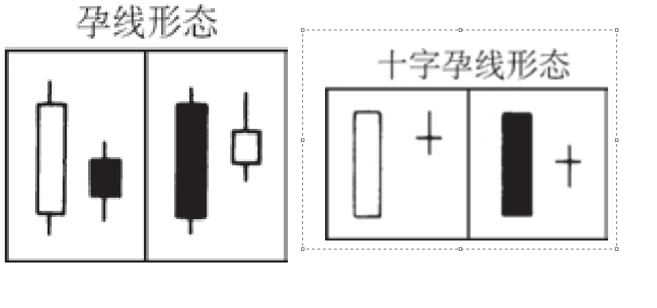

## 孕线形态

```
这是一种双蜡烛线形态，其中前一根是一个不寻常的巨大实体，

后一根是一个小实体，并且小实体居于大实体内部。

孕线形态暗示市场的当前趋势已经结束，牛方和熊方目前处于休战状态。其中小实体（即第二根蜡烛线）的颜色，既可以是白色的，也可以是黑色的。最常见的情况是，第二个实体的颜色同第一个实体的颜色相反。
```

## 十字孕线形态
—在孕线形态中，如果第二根蜡烛线是一个十字线，而不是一个小实体，则构成了一个十字孕线形态。

这是一类重要的顶部（或底部）反转信号，特别是当该十字线跟随在一根长长的白色（或黑色）实体之后的情况下。本形态也称为“呆滞形态（Petrifying pattern）”。