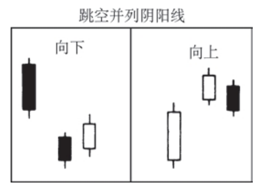

## 跳空并列阴阳线形态
也称“跳空并列黑白（蜡烛）线形态”。既有向上跳空的并列阴阳线形态，也有向下跳空的并列阴阳线形态。向上跳空并列阴阳线形态发生在上升趋势中，先是一根向上跳空的白色蜡烛线，然后跟着一根黑色蜡烛线，两根蜡烛线的大小差不多，并且黑色蜡烛线的开市价处于白色蜡烛线的实体之内，收市价低于白色蜡烛线的实体。黑色蜡烛线的收市价是多空双方交战的关键点。

向下跳空并列阴阳线形态发生在下降趋势中，先是一根向下跳空的黑色蜡烛线，然后跟着一根白色蜡烛线，两根蜡烛线的大小差不多，并且白色蜡烛线的开市价处于黑色蜡烛线的实体之内，收市价高于黑色蜡烛线的实体。这是一种看跌的持续形态。跳空并列阴阳线形态是一种少见的形态。

