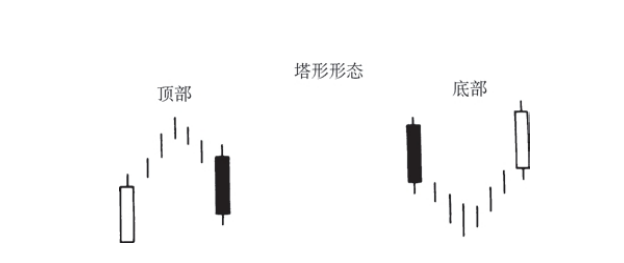

## 塔形形态

### 塔形顶部形态
属于顶部反转信号，其组成过程如下：先是一根或数根长长的白色蜡烛线，然后是一段整固行情，最后是一根到数根长长的黑色蜡烛线。在本形态中，整固区域两侧的蜡烛线貌似两个高塔，因此称之为塔形形态。

### 塔形底部形态
是一个底部反转形态。它的形成过程是：先是一根或数根长长的黑色蜡烛线，然后是一段水平整固行情，最后市场爆炸性地上冲，形成了一根到数根长长的白色蜡烛线。